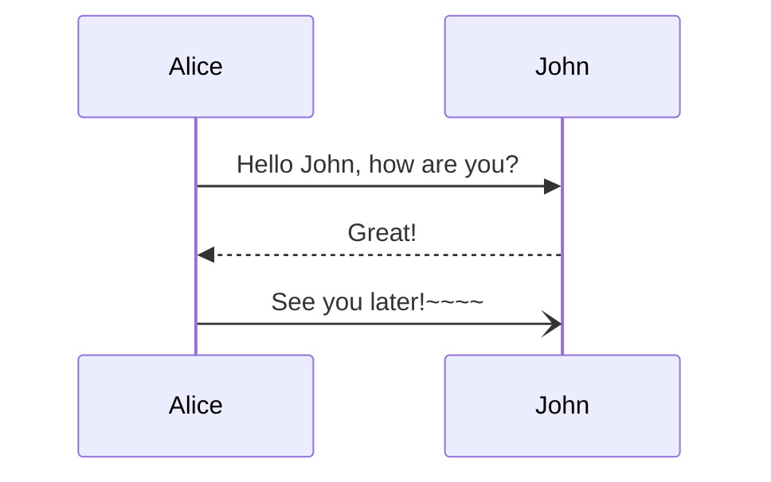

# Materials for `Pragmatic Software Architecture for Software Engineers` course

## Recording Setup

Here is the setup that was used for filming the course.

* Using `Open Broadcaster Software` as the recording software.
  * Using `Audio Input Capture` with following filters (all with default values):
    * `Noise Suppression`
    * `Compressor`
    * `Limiter`
  * Using `Video Capture Device` with `Cicle Blend` filter (mask PNG is in the `resources` directory).
  * Using `Display Capture` with default settings.
* Using `Yeti Blue` microphone for audio recording.
  * Using ~80% `GAIN`.
  * Using `Cardioid` pattern.
* Using 3 point lightning with 3 LCS smart lights.